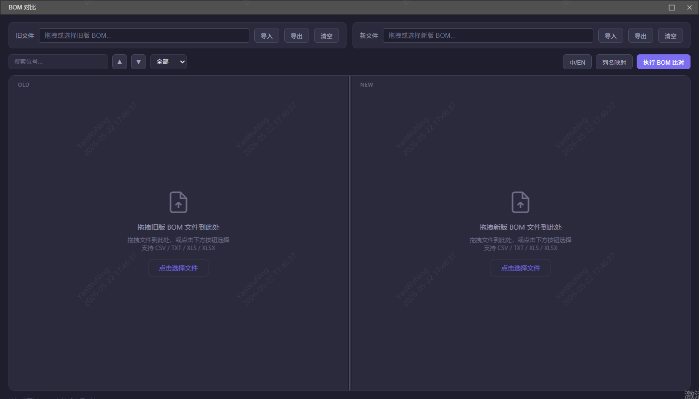
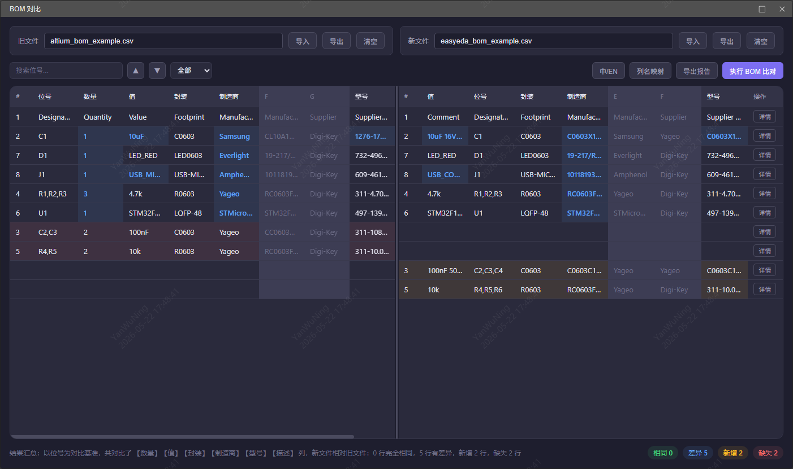
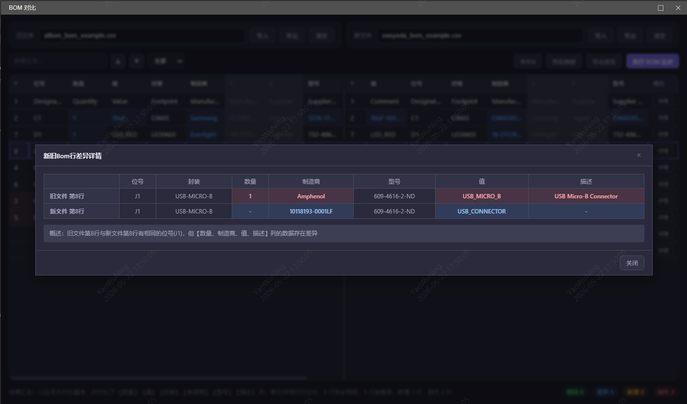
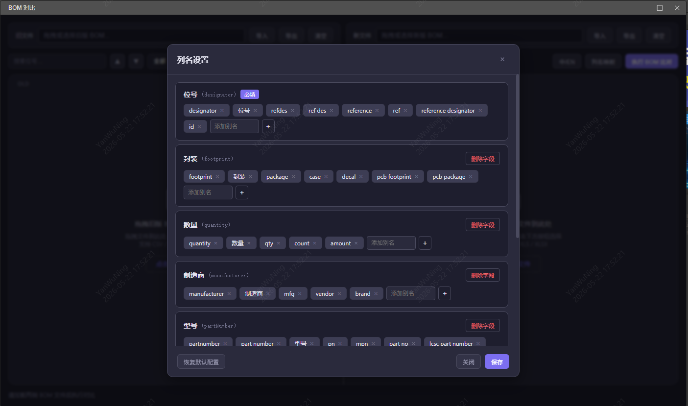

# BOM Compare - BOM 对比工具

中文 | [English](README.en.md)

嘉立创 EDA Pro 扩展，用于对比两个 BOM（物料清单）文件的差异，以表格形式直观展示变更内容。

## 功能特性

### 核心功能

- **多格式支持**：CSV、TXT、XLS、XLSX 格式导入
- **智能解析**：自动识别文件编码（UTF-8、GBK、GB2312）、表头行、分隔符
- **列名映射**：自动匹配常见中英文列名变体，支持手动配置映射关系
- **差异对比**：以位号（Designator）为基准，逐列对比并高亮差异
- **差异导航**：快速跳转上/下一处差异，支持按类型筛选（新增/缺失/变更/相同）
- **同步滚动**：左右面板联动滚动，方便逐行对照
- **导出报告**：支持导出对比结果为 CSV/XLSX 格式

### 交互体验

- **拖拽导入**：直接拖拽文件到面板即可加载
- **虚拟滚动**：支持上万行 BOM 数据流畅渲染
- **国际化**：支持中文/英文界面切换
- **快捷键**：Ctrl+D 执行对比、F3/Shift+F3 跳转差异、Ctrl+F 搜索
- **列宽调整**：支持拖拽调整列宽，双击列边框自适应内容宽度
- **搜索定位**：支持按位号或关键字搜索，快速定位到目标行
- **单元格复制**：点击单元格可快速复制内容
- **行联动高亮**：鼠标悬停某行时，对侧面板自动高亮对应位号的行

### 高级功能

- **重复列检测**：自动检测并警告重复的位号，避免匹配错误
- **列设置**：自定义选择参与对比的列
- **表头差异对比**：专门对比两个文件的表头差异
- **详情弹窗**：横向对比布局展示元器件详细变更信息
- **实时编辑**：编辑数据后实时更新对比结果
- **最近文件记录**：记录最近打开的文件路径，方便快速重新加载

## 界面布局

左右双面板布局，左侧为旧文件，右侧为新文件：

- 顶部：文件操作栏（导入、清空、导出）
- 中间：BOM 数据表格（支持列宽调整、排序、搜索）
- 底部：结果汇总栏（统计相同/差异/新增/缺失行数）

### 主界面截图

<!-- 截图占位符：主界面空状态 -->



## 差异高亮

| 颜色 | 含义 |
|------|------|
| 蓝色/青色单元格 | 值在新旧文件中不同 |
| 橙色/黄色整行 | 新文件中多出的元器件 |
| 红色/粉色整行 | 旧文件中存在但新文件中缺失 |
| 无高亮 | 完全一致 |

### 差异展示截图







## 开发

### 环境要求

- Node.js >= 20.17.0

### 安装依赖

```bash
npm install
```

### 常用命令

```bash
npm run compile    # 编译项目
npm run build      # 编译 + 打包扩展
npm run lint       # 代码检查
npm run fix        # 自动修复代码风格
npm run test       # 运行测试（watch 模式）
npm run test:run   # 运行测试（单次）
```

### 项目结构

```
├── src/                    # 扩展入口
│   └── index.ts            # 注册菜单，打开 iframe 窗口
├── iframe/                 # 主界面（iframe 内嵌页面）
│   ├── index.html          # 页面入口
│   ├── styles/             # 样式（CSS 变量、主题、布局、表格）
│   │   ├── variables.css
│   │   ├── theme.css
│   │   ├── layout.css
│   │   └── table.css
│   └── src/
│       ├── main.ts         # 初始化入口
│       ├── types.ts        # 类型定义
│       ├── locales/        # 国际化资源
│       │   ├── zh-Hans.ts
│       │   └── en.ts
│       ├── core/           # 核心逻辑
│       │   ├── parser/     # 文件解析（CSV、Excel）
│       │   ├── comparator.ts   # 对比算法
│       │   ├── column-mapper.ts # 列映射
│       │   ├── column-config.ts # 列配置
│       │   └── exporter.ts     # 导出
│       ├── ui/             # UI 组件
│       │   ├── table.ts        # 表格组件
│       │   ├── toolbar.ts      # 工具栏
│       │   ├── state.ts        # 状态管理
│       │   ├── summary.ts      # 汇总栏
│       │   ├── dialog.ts        # 对话框
│       │   ├── column-settings-dialog.ts # 列设置对话框
│       │   ├── sheet-selector.ts    # Sheet 选择器
│       │   ├── drop-zone.ts        # 拖拽区域
│       │   ├── editable.ts         # 可编辑单元格
│       │   ├── loading.ts          # 加载状态
│       │   ├── tooltip.ts         # 提示框
│       │   ├── column-resize.ts    # 列宽调整
│       │   └── layout.ts          # 布局
│       └── utils/          # 工具函数
│           ├── i18n.ts      # 国际化
│           ├── encoding.ts  # 编码检测
│           ├── hotkeys.ts   # 快捷键
│           └── storage.ts   # 本地存储
├── tests/                  # 测试用例及样本数据
│   ├── comparator.test.ts
│   ├── csv-parser.test.ts
│   └── data/               # 测试样本数据
├── locales/                # 扩展菜单国际化
│   ├── zh-Hans.json
│   ├── en.json
│   └── extensionJson/      # 扩展注册菜单翻译
│       ├── zh-Hans.json
│       └── en.json
├── docs/                   # 文档
│   ├── prd.md              # 产品需求文档
│   ├── features.md         # 功能需求文档
│   ├── dev-plan.md         # 开发计划
│   └── easyeda-iframe-bug-workaround.md
├── config/                 # esbuild 构建配置
│   ├── esbuild.common.ts
│   └── esbuild.prod.ts
├── build/                  # 打包脚本
│   └── packaged.ts
├── images/                 # 图片资源
│   └── logo.png
├── dist/                   # 编译输出（gitignore）
├── extension.json          # 扩展配置
├── package.json            # 项目依赖和脚本配置
├── tsconfig.json           # TypeScript 编译配置
├── vitest.config.ts        # Vitest 测试配置
└── eslint.config.mjs       # ESLint 代码检查配置
```

### 技术栈

- TypeScript（strict 模式）
- esbuild（构建）
- Vitest（测试）
- xlsx / papaparse / jschardet（文件解析）
- @jlceda/pro-api-types（EDA 扩展 API）

## 使用方式

### 快速开始

1. 安装扩展后，在嘉立创 EDA Pro 的首页、原理图编辑器或 PCB 编辑器的顶部菜单中点击 **BOM Compare** 即可打开
2. 点击左侧面板的「导入」按钮，选择旧版本的 BOM 文件
3. 点击右侧面板的「导入」按钮，选择新版本的 BOM 文件
4. 点击「执行BOM比对」按钮，或使用快捷键 Ctrl+D
5. 查看对比结果，使用差异导航按钮快速定位变更

### 详细使用步骤

#### 步骤 1：加载文件

- **方式一**：点击「导入」按钮，从文件选择器中选择 BOM 文件
- **方式二**：直接将文件拖拽到对应的面板区域

支持的文件格式：
- CSV (.csv)
- TXT (.txt)
- XLS (.xls)
- XLSX (.xlsx)


#### 步骤 2：配置列映射（如需要）

如果文件列名无法自动匹配，系统会弹出列映射配置面板：
- 左侧显示源文件的列名
- 右侧选择对应的标准列名
- 可选择「忽略该列」
- 配置会自动保存，下次加载相同格式文件时自动应用

<!-- 截图占位符：列映射配置 -->


#### 步骤 3：执行对比

- 点击「执行BOM比对」按钮，或使用快捷键 Ctrl+D
- 系统会以位号（Designator）为基准进行对比
- 默认对比所有列，可在列设置中自定义


#### 步骤 4：查看结果

- 底部汇总栏显示统计信息：相同、差异、新增、缺失的行数
- 使用「上一处差异」/「下一处差异」按钮快速跳转
- 使用筛选器按类型查看：全部/仅差异/仅新增/仅缺失/仅相同
- 点击行末的「详情」按钮查看横向对比详情


#### 步骤 5：导出报告

- 点击「导出」按钮导出当前 BOM 数据
- 点击「导出报告」生成包含变更摘要和详细差异的报告


## 常见问题

### Q: 支持哪些文件格式？

A: 支持 CSV、TXT、XLS、XLSX 格式。系统会自动识别文件编码（UTF-8、GBK、GB2312）。

### Q: 如何对比两个不同列名的 BOM 文件？

A: 系统会自动匹配常见的中英文列名变体。如果自动匹配失败，您可以手动指定对应关系。

### Q: 对比基准是什么？

A: 以位号（Designator）作为对比基准。系统会根据位号匹配左右两侧的行，然后逐列对比其他字段的值。


### Q: 如何快速定位差异？

A: 使用「上一处差异」/「下一处差异」按钮，或使用快捷键 F3/Shift+F3。也可以使用筛选器按类型查看。

### Q: 导出的报告包含什么内容？

A: 导出报告包含三个 Sheet：变更摘要、差异详情、完整对比。

## 快捷键

| 快捷键 | 功能 |
|--------|------|
| Ctrl+D | 执行 BOM 对比 |
| F3 | 下一处差异 |
| Shift+F3 | 上一处差异 |
| Ctrl+F | 搜索 |


## 更新日志

查看 [CHANGELOG.md](CHANGELOG.md) 了解版本更新历史。


